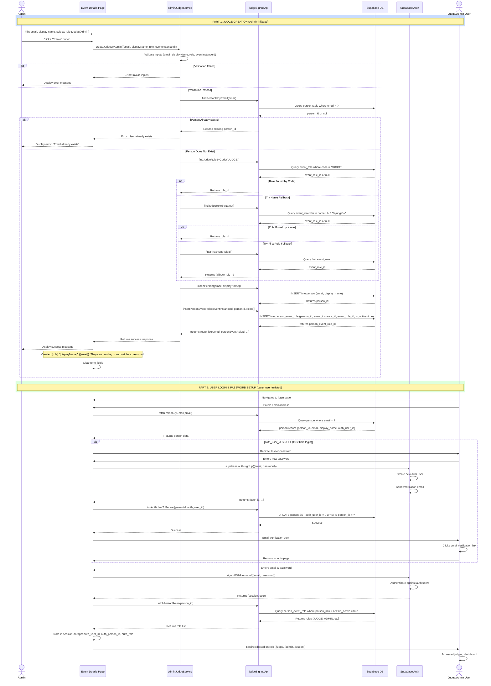

# Judge Creation & Login Flow

```mermaid
sequenceDiagram
    actor Admin
    participant EventPage as Event Details Page
    participant AdminService as adminJudgeService
    participant SignupApi as judgeSignupApi
    participant DB as Supabase DB
    participant Auth as Supabase Auth
    actor JudgeUser as Judge/Admin User

    rect rgb(200, 220, 255)
    Note over Admin,JudgeUser: PART 1: JUDGE CREATION (Admin-initiated)
    end

    Admin->>EventPage: Fills email, display name, selects role (Judge/Admin)
    Admin->>EventPage: Clicks "Create" button
    EventPage->>AdminService: createJudgeOrAdmin({email, displayName, role, eventInstanceId})
    
    AdminService->>AdminService: Validate inputs (email, displayName, role, eventInstanceId)
    alt Validation Failed
        AdminService-->>EventPage: Error: Invalid inputs
        EventPage-->>Admin: Display error message
    else Validation Passed
        AdminService->>SignupApi: findPersonIdByEmail(email)
        SignupApi->>DB: Query person table where email = ?
        DB-->>SignupApi: person_id or null
        
        alt Person Already Exists
            SignupApi-->>AdminService: Returns existing person_id
            AdminService-->>EventPage: Error: User already exists
            EventPage-->>Admin: Display error: "Email already exists"
        else Person Does Not Exist
            AdminService->>SignupApi: findJudgeRoleByCode("JUDGE")
            SignupApi->>DB: Query event_role where code = "JUDGE"
            DB-->>SignupApi: event_role_id or null
            
            alt Role Found by Code
                SignupApi-->>AdminService: Returns role_id
            else Try Name Fallback
                AdminService->>SignupApi: findJudgeRoleByName()
                SignupApi->>DB: Query event_role where name LIKE "%judge%"
                DB-->>SignupApi: event_role_id or null
                
                alt Role Found by Name
                    SignupApi-->>AdminService: Returns role_id
                else Try First Role Fallback
                    AdminService->>SignupApi: findFirstEventRoleId()
                    SignupApi->>DB: Query first event_role
                    DB-->>SignupApi: event_role_id
                    SignupApi-->>AdminService: Returns fallback role_id
                end
            end
            
            AdminService->>SignupApi: insertPerson({email, displayName})
            SignupApi->>DB: INSERT into person (email, display_name)
            DB-->>SignupApi: Returns person_id
            
            AdminService->>SignupApi: insertPersonEventRole({eventInstanceId, personId, roleId})
            SignupApi->>DB: INSERT into person_event_role (person_id, event_instance_id, event_role_id, is_active=true)
            DB-->>SignupApi: Returns person_event_role_id
            
            SignupApi-->>AdminService: Returns result {personId, personEventRoleId, ...}
            AdminService-->>EventPage: Returns success response
            EventPage-->>Admin: Display success message
            Note over EventPage: Created [role] "[displayName]" ([email]). They can now log in and set their password.
            EventPage->>EventPage: Clear form fields
        end
    end

    rect rgb(220, 255, 220)
    Note over Admin,JudgeUser: PART 2: USER LOGIN & PASSWORD SETUP (Later, user-initiated)
    end

    JudgeUser->>EventPage: Navigates to login page
    JudgeUser->>EventPage: Enters email address
    EventPage->>SignupApi: fetchPersonByEmail(email)
    SignupApi->>DB: Query person where email = ?
    DB-->>SignupApi: person record {person_id, email, display_name, auth_user_id}
    SignupApi-->>EventPage: Returns person data
    
    alt auth_user_id is NULL (First time login)
        EventPage->>JudgeUser: Redirect to /set-password
        JudgeUser->>EventPage: Enters new password
        EventPage->>Auth: supabase.auth.signUp({email, password})
        Auth->>Auth: Create new auth user
        Auth->>Auth: Send verification email
        Auth-->>EventPage: Returns {user_id, ...}
        
        EventPage->>SignupApi: linkAuthUserToPerson(personId, auth_user_id)
        SignupApi->>DB: UPDATE person SET auth_user_id = ? WHERE person_id = ?
        DB-->>SignupApi: Success
        
        SignupApi-->>EventPage: Success
        EventPage->>JudgeUser: Email verification sent
        JudgeUser->>JudgeUser: Clicks email verification link
        JudgeUser->>EventPage: Returns to login page
    end
    
    JudgeUser->>EventPage: Enters email & password
    EventPage->>Auth: signInWithPassword({email, password})
    Auth->>Auth: Authenticate against auth.users
    Auth-->>EventPage: Returns {session, user}
    
    EventPage->>SignupApi: fetchPersonRoles(person_id)
    SignupApi->>DB: Query person_event_role where person_id = ? AND is_active = true
    DB-->>SignupApi: Returns roles [JUDGE, ADMIN, etc]
    SignupApi-->>EventPage: Returns role list
    
    EventPage->>EventPage: Store in sessionStorage: auth_user_id, auth_person_id, auth_role
    EventPage->>JudgeUser: Redirect based on role (/judge, /admin, /student)
    JudgeUser->>JudgeUser: Accessed judging dashboard

```